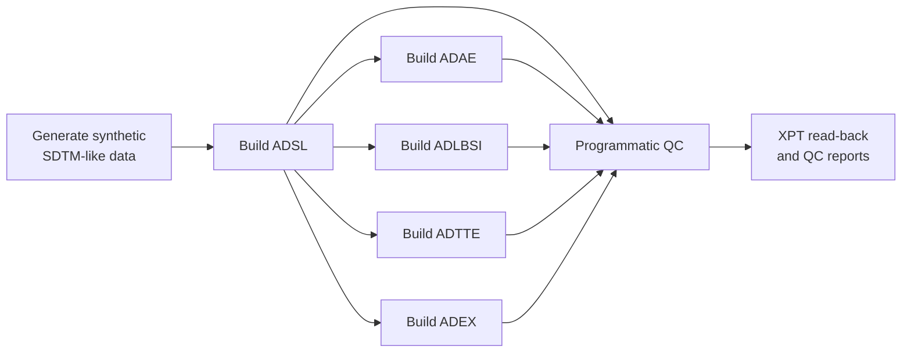

# Clinical ADaM Programming & Validation in R


An **R-based clinical statistical programming portfolio project** demonstrating the creation, export, and programmatic validation of five ADaM-style analysis datasets: **ADSL, ADAE, ADLBSI, ADTTE, and ADEX**. The workflow starts with reproducibly generated synthetic SDTM-like data and produces SAS Transport (`.xpt`) and RDS outputs.

> **Portfolio note:** This is an educational, synthetic recreation of clinical analysis-programming concepts. It contains no original clinical study data or confidential reference outputs. The examples are **ADaM-style**; they are not represented as a fully CDISC-conformant regulatory submission or an independent comparison against a reference programmer.

## Project Highlights

- Generates synthetic SDTM-like source data with a reproducible random seed.
- Derives subject-level treatment variables, age groups, and analysis flags in **ADSL**.
- Calculates treatment-emergent flags and relative study days for adverse events in **ADAE**.
- Selects eligible laboratory baseline records and derives change and percent change in **ADLBSI**.
- Implements illustrative progression-free and overall survival event/censor logic in **ADTTE**.
- Removes duplicate dose-accountability records before calculating exposure summaries in **ADEX**.
- Exports the five analysis datasets in SAS Transport format and performs automated QC, including XPT read-back checks.

## Analysis Datasets

| Dataset | What the program demonstrates |
|:--|:--|
| **ADSL** | Subject-level analysis data, treatment assignment, treatment dates, and analysis flags |
| **ADAE** | Adverse-event analysis, treatment-emergent flags, and study days |
| **ADLBSI** | Laboratory baseline selection, change, and percent change |
| **ADTTE** | Illustrative PFS and OS event/censor derivations |
| **ADEX** | Exposure duration, cumulative capsules, dose, and dose intensity |

## Workflow



The `run_all.R` script runs each stage in order, so the pipeline can be executed from the repository root with a single command.

## Repository Structure

```text
clinical-adam-r-validation/
├── R/
│   ├── 00_setup.R
│   ├── 01_generate_synthetic_data.R
│   ├── 02_build_adsl.R
│   ├── 03_build_adae.R
│   ├── 04_build_adlbsi.R
│   ├── 05_build_adtte.R
│   ├── 06_build_adex.R
│   ├── 07_validate_outputs.R
│   └── run_all.R
├── .gitignore
└── README.md
```

The pipeline creates `data/raw/`, `data/output/`, and `reports/` **locally** when it runs. Generated datasets and reports are excluded from version control by `.gitignore`.

## How to Run

**Requirements:** R and the `dplyr` and `haven` packages.

1. Clone or download the repository and open its top-level folder in RStudio.
2. Install dependencies if needed:

   ```r
   install.packages(c("dplyr", "haven"))
   ```

3. With your working directory set to the repository root, run:

   ```r
   source("R/run_all.R")
   ```

The workflow generates the synthetic inputs, builds all five datasets, writes XPT and RDS files to `data/output/`, and saves local QC summaries in `reports/`.

**Execution status:** The project author completed a local RStudio run and reported that all included programmatic validation checks passed on the generated synthetic data. The original clinical assignment and any confidential reference comparisons are not included in this public repository.

## Derivation and Validation

| Area | Checks or methods demonstrated |
|:--|:--|
| **ADSL** | Unique subject identifiers and nonmissing treatment dates |
| **ADAE** | Presence of subject identifiers; treatment-emergent and study-day derivations |
| **ADLBSI** | Latest eligible pre-treatment baseline (sequence breaks same-day ties); uniqueness and percent-change formula checks |
| **ADTTE** | Illustrative event/censor rules, allowed censor values, and positive analysis durations |
| **ADEX** | Defined duplicate-removal key, four expected analysis parameters, and one record per subject/parameter |
| **XPT exports** | File existence, successful read-back, matching row counts, and matching variable order |

For laboratory records, percent change is calculated only when a nonmissing, nonzero baseline is available:

```text
PCHG = 100 × (AVAL − BASE) / BASE
```

**Scope:** These are programmatic checks of the synthetic example, not full independent double programming, metadata/value equivalence against confidential reference datasets, or formal CDISC compliance validation. The time-to-event examples use simplified observation and censoring rules; actual clinical trials require protocol- and SAP-specific definitions.

## Skills Demonstrated

**R · dplyr · haven · Clinical statistical programming · ADaM concepts · Synthetic data generation · Analysis dataset derivations · Baseline selection · Time-to-event logic · SAS Transport export · Programmatic validation · Reproducible workflows**

## Data and Confidentiality

All source records in this public example are **synthetically generated**. The repository does not include real patient-level data, sponsor identifiers, confidential specifications, study protocols, proprietary outputs, or reference programmer datasets. Generated local files and reports are excluded through `.gitignore`.

## Author

**Rhutika Patil**  
M.S. in Bioinformatics, North Carolina State University  
[GitHub](https://github.com/Rhutikapatil) · [LinkedIn](https://www.linkedin.com/in/rhutika-patil/)
